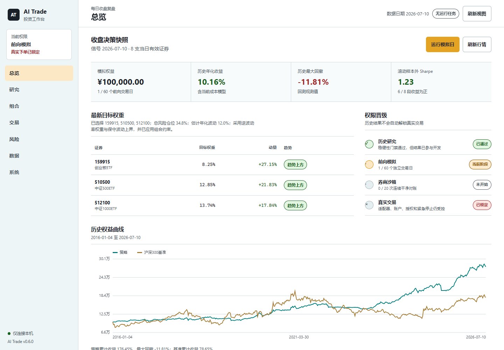

# AI Trade

[](https://github.com/Shiraikuroko123/ai-trade/actions/workflows/ci.yml)
[](https://github.com/Shiraikuroko123/ai-trade/releases)
[](https://www.python.org/)
[](LICENSE)

[架构](docs/ARCHITECTURE.md) · [AI K线助理](docs/AI_ASSISTANT.md) · [系统对照](docs/ECOSYSTEM.md) · [标的池与市场规则](docs/UNIVERSE.md) · [研究方法](docs/RESEARCH_METHODOLOGY.md) · [模拟盘运维](docs/PAPER_TRADING.md) · [云端行情快照](docs/CLOUD_STORAGE.md) · [券商适配器](docs/BROKER_ADAPTERS.md) · [安全策略](SECURITY.md) · [更新记录](CHANGELOG.md)

`v0.12.0` 是 AI Trade 的首个公开发行版。这是一个面向中国个人投资者的本地系统化研究与模拟交易工作台。默认策略使用 A 股场内 ETF 日线，只做多、不加杠杆；底层投资池采用时点有效的证券主数据模型，不存在“最多 8 只”的代码限制。独立的只读行情工作台提供日/周/月 K 线、成交量、MA/EMA/BOLL、MACD/KDJ/RSI/Wilder ATR、十字线、缩放和当前模拟账户成交标记，全部绑定同一份已完成行情快照。证券选择来自配置主数据，不在前端写死数量。策略实验室要求候选完成同快照对照、留出集、成本、回撤与稳定性验证并经人工批准；AI K 线助理只有 `research_only` 权限。交易页还可把券商导出的标准成交 CSV 导入本地影子账户，复核行为、相对模拟成交价和成交分配偏差。可选择的“仅本地 / 本地 + R2”存储、腾讯网络回退、可恢复缓存事务、内测登录、券商能力声明、限定标的/方向/额度的 mandate、逐批一次性人工批准、可重启恢复的订单生命周期账本与多重实盘门禁均已纳入安全边界，但没有内置任何可用的真实券商适配器，真实下单保持关闭。

系统已经贯通以下流程：

1. 按证券上市/退市日期和成分生效区间，生成历史时点可见的动态候选池。
2. 以东方财富为主数据源、腾讯财经为网络回退，下载、校验并以整套快照缓存候选标的历史行情。
3. 用趋势、相对强弱、波动率、流动性、资金容量和分组暴露生成目标仓位。
4. 按信号后下一交易日开盘成交，计入整手、滑点、佣金、印花税、过户费、停牌和涨跌停约束。
5. 运行历史回测、沪深 300 ETF 基准对比和连续滚动样本外验证。
6. 维护支持断档逐日追赶、风险冷却和幂等执行的本地模拟账户。
7. 生成 HTML、CSV、JSON 和 Markdown 审计报告。
8. 通过只绑定回环地址的本地浏览器工作台复盘信号、组合、交易、风险、数据和任务。
9. 在独立行情页审阅日/周/月 OHLCV、技术指标、快照证据和当前模拟账户成交标记，不隐式刷新或写入状态。
10. 用本地规则或用户自行配置的模型复核已收盘 K 线，但只返回四类研究结论，不生成订单或改变门禁。
11. 在同一工作台管理本地 / 混合存储策略、云端清点、快照备份和本机预算。
12. 在每个登录用户隔离的策略实验室中创建、验证、批准、导出和激活模拟策略版本，并用不可变近期证据人工决定暂停、恢复、退役或回滚。
13. 将券商成交文件严格标准化为本地不可变影子账本，识别重复或冲突成交，并与当前模拟成交做非晋级偏差复盘。
14. 从本地券商订单与成交账本恢复每笔订单的当前状态，校验部分成交、撤单竞态、乱序回报和重启后的账本一致性。
15. 用原子作用域清单把未来券商生命周期账本绑定到适配器、账户引用、环境、配置与账本路径，阻止跨账户或跨配置混写。

历史收益不代表未来结果。本项目不提供投资建议或盈利承诺，当前版本只用于研究和本地模拟；它没有可工作的真实券商适配器，也不应被视为已经具备实盘交易条件。

## 快速开始

推荐普通用户从 [GitHub Releases](https://github.com/Shiraikuroko123/ai-trade/releases/tag/v0.12.0) 安装首个公开发行版。下面的命令创建隔离环境和独立工作目录，不需要 Git：

```powershell
New-Item -ItemType Directory -Force .\AI-Trade-v0.12.0 | Out-Null
Set-Location .\AI-Trade-v0.12.0
python -m venv .venv
.\.venv\Scripts\python.exe -m pip install "https://github.com/Shiraikuroko123/ai-trade/releases/download/v0.12.0/ai_trade-0.12.0-py3-none-any.whl"
.\.venv\Scripts\ai-trade.exe init --directory .\workspace
Set-Location .\workspace
..\.venv\Scripts\ai-trade.exe download --force
..\.venv\Scripts\ai-trade.exe serve --owner-local
```

Release 页面同时提供源码包和 `SHA256SUMS.txt`；下载文件后可用 `Get-FileHash .\文件名 -Algorithm SHA256` 与清单核对。开发者或需要配置脚本的用户可克隆源码：

在 PowerShell 中运行：

```powershell
git clone https://github.com/Shiraikuroko123/ai-trade.git
cd ai-trade
powershell -ExecutionPolicy Bypass -File .\scripts\bootstrap.ps1
.\.venv\Scripts\python.exe -m ai_trade.cli download --force
.\.venv\Scripts\python.exe -m ai_trade.cli serve --owner-local
```

`serve --owner-local` 只适合工作区所有者在自己的可信电脑上使用，它保留回环地址限制但跳过内测登录。命令会打印并打开类似 `http://127.0.0.1:8765/` 的地址；不要直接双击 `src/ai_trade/web/assets/index.html`。端口占用时可以增加 `--port 8877`。

### 可选 QMT 只读连接

源码仓库包含独立安装的 `adapters/qmt` 观察插件。它只读取本机已登录 QMT 的账户、持仓、可撤委托和当日成交，拒绝实盘模式、下单与撤单；由于 QMT API 不能可靠证明账号属于模拟盘，读取和比较结果不会写入 20 次沙盒晋级证据。每个插件还必须发布机器可读的能力清单，未声明操作、环境不匹配或运行时能力漂移都会在调用前失败关闭。安装、创建 Git 忽略配置和运行 `broker-list`、`broker-probe`、`broker-compare` 的完整步骤见 [券商适配器](docs/BROKER_ADAPTERS.md#optional-qmt-read-only-probe)。

### 影子账户成交复盘

打开工作台 **交易 → 影子复盘**，先下载空白模板，再把券商导出文件转换为以下 UTF-8 表头；列名、顺序和大小写必须完全一致：

```csv
fill_id,order_id,symbol,side,quantity,price,commission,tax,filled_at
```

`side` 只能是 `BUY` 或 `SELL`，`symbol` 是六位证券代码，数量为正整数，金额为非负有限小数，`filled_at` 必须是带时区的 ISO-8601 时间，例如 `2026-07-15T09:31:00+08:00`。页面只要求来源标签和账户**别名**，不要填写真实资金账号。默认单次上限为 1,000,000 字节和 5,000 行。

导入前会校验完整文件；同一文件重复导入是幂等操作，重叠导出中的相同成交会被识别为重复，同一来源/账户别名下相同 `fill_id` 若出现不同数量、价格或其他字段则整批拒绝。原始 CSV 不会保存；系统只在 Git 忽略的 `state/shadow_fills.csv` 和 `state/shadow_imports.csv` 中保留标准化行、整行 SHA-256、文件 SHA-256 和导入审计。它们不会上传 R2。

复盘将导入窗口内的成交与当前模拟成交按日期、证券和方向聚合，报告匹配覆盖、不利价格偏差和按成交额计算的分配偏差。该比较不是持仓或现金对账，不证明券商环境属于模拟盘，也不会写入沙箱连续对账、改变策略、创建订单或解锁真实交易。格式与安全边界详见 [券商适配器](docs/BROKER_ADAPTERS.md#shadow-account-csv-review)。

### 券商订单生命周期审计

打开工作台 **交易 → 券商账本** 可以查看由 `state/broker_orders.csv` 与 `state/broker_fills.csv` 重建的每笔订单当前状态。系统按带时区的券商时间归并延迟回报，累计部分成交，允许“撤单处理中”期间继续部分或全部成交，并拒绝终态回退、累计成交量倒退、订单身份漂移、孤立成交和成交合计不一致。

每次适配器轮询应把同一批订单快照与成交传给 `append_broker_observation`。函数会先在双账本锁内验证完整候选状态，再追加订单和成交；若进程在两次追加之间中断，下次使用相同快照和成交重试即可幂等修复。持久锁使用操作系统文件锁，进程异常退出后不会因遗留 `.lock` 文件永久阻塞。当前 QMT 插件只做非持久化只读探测，不会自动生成这些生命周期记录。

同一进程内的并发写入会先串行化；每一本 CSV 都先在同目录临时文件中完成、落盘，再原子替换活动账本，因此单行写入或替换失败不会覆盖上一份有效文件。订单预约时间按中国标准时间的交易日零点记录，避免本地凌晨时券商 UTC 回报被错误排到预约事件之前。订单与成交仍是两本独立账本；两次原子发布之间若中断，必须使用完全相同的观察重试修复。

新订单事件使用 `v2_` 前缀的整行规范化内容指纹，新成交行使用完整的 `record_sha256`；两者都会在读取时重算，可发现订单字段、成交价格或费用被意外改写。旧版 24 位订单事件 ID 与不含 `record_sha256` 的旧成交表头仍可直接读取和幂等重试，历史行不会被自动迁移；对旧成交账本追加时也会保留旧表头，避免把未校验历史伪装成新证据。账本中的 `10` 与新版规范化的 `10.0` 按相同数值处理。这些指纹用于本地完整性检查，不是数字签名，也不能替代文件权限、备份或券商侧对账。

新作用域清单位于 `state/broker_ledger_scope.json`，在第一条合格写入前原子创建，并同时绑定适配器、不可逆账户引用、沙箱/实盘环境、活动配置指纹以及订单/成交账本路径。页面只显示 12 位账户引用，不返回明文券商账户号。未来提交路由会在券商 I/O 前核对该清单；账户、环境、配置或路径不一致会直接拒绝。已经存在但没有清单的旧 CSV 仍可恢复查看，不过会显示“旧账本未绑定”，不能继续追加；应先人工归档，再让新适配器从空账本建立作用域，不要手工伪造或迁移清单。

页面中的“账本已核验”只表示本地订单事件和成交明细自洽。它不是现金或持仓对账，不写入 20 次沙箱晋级证据，不改变策略，也不解除真实下单门禁。状态机、适配器调用约束和失败处理见 [券商适配器](docs/BROKER_ADAPTERS.md#order-lifecycle-recovery)。

### 正式沙箱对账证据

正式现金与持仓对账记录位于本地 `state/broker_reconciliation.csv`。新记录以 `v2_` 内容指纹同时绑定适配器、账户、日期、配置、现金与问题明细；读取时会先校验整本账本，再统计当前账户的连续干净会话。并发写入会串行化，更新通过同目录临时文件落盘后原子替换；同一次观察可以幂等重试，替换失败会保留上一份完整文件。若同一账户、日期和配置出现不同内容，冲突也会被保留并关闭晋级资格，不能靠保留旧的“干净”行继续累计。

旧版 24 位 ID 只绑定记录身份，无法证明现金和问题明细未被改写，因此升级后仍可读取和幂等复查，但不再计入默认 20 次晋级门槛，也不会自动迁移。需要由未来具备合格沙箱对账能力的适配器重新积累 `v2_` 会话；当前 QMT 只读插件不会写入这类证据。内容指纹不是数字签名，不能替代本地文件权限、备份和券商侧正式结单。

### Windows 后台运行与登录自启

工作台必须有一个本地 Python 进程运行，但不需要一直显示 PowerShell 窗口。源码克隆用户完成 `bootstrap.ps1` 后，可以在仓库根目录执行以下命令隐藏启动一次：

```powershell
$Root = (Get-Location).Path
$Python = Join-Path $Root '.venv\Scripts\python.exe'
$Config = Join-Path $Root 'config\default.json'

if (Get-NetTCPConnection -LocalPort 8877 -State Listen -ErrorAction SilentlyContinue) {
    throw '8877 端口已经被占用；请先确认现有服务。'
}

Start-Process `
  -FilePath $Python `
  -ArgumentList @(
    '-m', 'ai_trade.cli',
    '--config', $Config,
    'serve', '--owner-local',
    '--host', '127.0.0.1',
    '--port', '8877',
    '--no-open'
  ) `
  -WorkingDirectory $Root `
  -WindowStyle Hidden
```

若希望每次登录 Windows 自动启动，在仓库根目录用普通 PowerShell 执行一次下面的注册命令，不需要另外保存脚本文件：

```powershell
$Root = (Get-Location).Path
$Python = Join-Path $Root '.venv\Scripts\python.exe'
$Config = Join-Path $Root 'config\default.json'
$User = "$env:USERDOMAIN\$env:USERNAME"
$ServerCommand = "& '$Python' -m ai_trade.cli --config '$Config' serve --owner-local --host 127.0.0.1 --port 8877 --no-open"

$Action = New-ScheduledTaskAction `
  -Execute 'powershell.exe' `
  -Argument "-NoProfile -WindowStyle Hidden -ExecutionPolicy Bypass -Command `"$ServerCommand`"" `
  -WorkingDirectory $Root
$Trigger = New-ScheduledTaskTrigger -AtLogOn -User $User
$Principal = New-ScheduledTaskPrincipal `
  -UserId $User `
  -LogonType Interactive `
  -RunLevel Limited
$Settings = New-ScheduledTaskSettingsSet `
  -AllowStartIfOnBatteries `
  -DontStopIfGoingOnBatteries `
  -RestartCount 3 `
  -RestartInterval (New-TimeSpan -Minutes 1) `
  -ExecutionTimeLimit ([TimeSpan]::Zero) `
  -MultipleInstances IgnoreNew

Register-ScheduledTask `
  -TaskName 'AI Trade Workstation' `
  -Action $Action `
  -Trigger $Trigger `
  -Principal $Principal `
  -Settings $Settings `
  -Description 'Start the loopback-only AI Trade workstation at sign-in.' `
  -Force
Start-ScheduledTask -TaskName 'AI Trade Workstation'
```

等待数秒后打开 `http://127.0.0.1:8877/`，并检查版本：

```powershell
Invoke-RestMethod http://127.0.0.1:8877/api/bootstrap |
  Select-Object version
```

更新代码或用户级 AI/R2 环境变量后，重启任务让新进程重新读取配置：

```powershell
Stop-ScheduledTask -TaskName 'AI Trade Workstation' -ErrorAction SilentlyContinue
Start-ScheduledTask -TaskName 'AI Trade Workstation'
```

不再需要自动启动时执行：

```powershell
Stop-ScheduledTask -TaskName 'AI Trade Workstation' -ErrorAction SilentlyContinue
Unregister-ScheduledTask -TaskName 'AI Trade Workstation' -Confirm:$false
```

任务只绑定 `127.0.0.1`，并从当前 Windows 用户环境继承可选 AI/R2 配置；密钥不写入任务参数。共享电脑或朋友部署不要使用 `--owner-local`，应改用内测登录模式。wheel 用户也可以使用同一方法，但要把 `$Python` 和 `$Config` 改为自己的虚拟环境与独立工作区路径。

朋友或其他内测部署默认需要账号。用户文件只保存加盐密码验证器并位于 Git 忽略的 `state/`：

```powershell
.\.venv\Scripts\python.exe -m ai_trade.cli beta-user-add friend-name
.\.venv\Scripts\python.exe -m ai_trade.cli serve
```

管理员可以使用 `beta-user-list`、`beta-user-enable`、`beta-user-disable` 和 `beta-user-remove --yes` 管理名单。跨电脑分发时，先用 `beta-users-export ..\AI-Trade-内测名单.json` 导出到仓库外，再在朋友的工作区运行 `beta-users-import ..\AI-Trade-内测名单.json`；导出包不含明文密码或会话，但包含离线密码验证器，仍应私下传递且不得提交 Git。密码替换、停用或删除账号后，已有会话会在下一次请求时失效。纯本地认证不能阻止拥有源码和本机管理权限的人主动绕过，强制授权和实时撤权需要独立 HTTPS 认证服务。



工作台可以刷新行情、运行回测/滚动验证/稳健性验证、初始化和推进模拟账户、查看成交与拒单、审查风险门禁、下载本地报告。真实订单按钮在券商适配器、模拟门禁、沙箱对账、紧急停止和限时人工授权全部通过前保持禁用。

## 专业行情工作台

左侧 **行情** 视图使用随 wheel 本地分发的 KLineChart 10.0.0，不访问 CDN。后端只接受配置证券、`day/week/month` 周期和有界根数；周/月 OHLCV 由已验证日线按自然周期确定性聚合，日期使用该周期最后一个实际交易日，不补造交易会话。页面同时显示配置数据源、实际回退来源、复权口径、已完成交易日、manifest 与行情文件指纹。缓存缺失或陈旧时会明确显示恢复状态，不会在 GET 请求中下载或改写数据。

图表操作只改变当前浏览器视图。指标切换、缩放、十字线和模拟成交标记不会修改策略候选、活动模拟配置、持仓账本、云端快照或券商权限。分钟线、分时、盘口和实时推送尚未接入；项目不会用日线伪造这些数据。

## 可选 AI K 线助理

完成上面的启动步骤后，打开命令打印的回环地址，在左侧导航选择 **AI 分析**。默认本地模式不需要 API Key；选择标的和 **回看交易日** 后即可对已完成 K 线做研究复核。助理结论只有 `NO_ACTION`、`WATCH`、`REVIEW_CANDIDATE` 和 `REDUCE_RISK`：它们都不是买卖指令，其中 `REDUCE_RISK` 也只表示需要人工检查风险，不表示自动卖出或调整仓位。

需要使用自己的 OpenAI 兼容模型端点时，在 PowerShell 运行：

```powershell
powershell -ExecutionPolicy Bypass -File .\scripts\configure_ai.ps1
# 配置完成后停止并重新启动工作台
.\.venv\Scripts\python.exe -m ai_trade.cli serve --owner-local
```

脚本默认 Base URL 为 `https://api.openai.com/v1`，交互设置当前 Windows 用户的 `AI_TRADE_AI_BASE_URL`、`AI_TRADE_AI_MODEL`、`AI_TRADE_AI_API_KEY` 和 `AI_TRADE_AI_TIMEOUT_SECONDS`。Key 通过 `SecureString` 输入，不回显，也不会写入仓库配置、助理历史、R2 快照或发行包。远程地址必须使用 HTTPS；HTTP 只允许本机 loopback。设置后必须重启工作台，让新进程读取用户环境变量。

关闭模型增强模式并继续使用零 Key 本地模式：

```powershell
powershell -ExecutionPolicy Bypass -File .\scripts\configure_ai.ps1 -Disable
```

助理始终为 `research_only`：不能创建订单意图、目标仓位、入场/止损/止盈价格，不能解锁模拟晋级、沙箱对账、人工授权、紧急停止或真实交易门禁，也不提供收益承诺。每个本地用户的历史位于 Git 忽略的 `state/assistant/`，不会进入 R2 或发行版。完整模式说明、变量约束、数据边界和故障处理见 [AI K线助理](docs/AI_ASSISTANT.md)。

命令行研究流程仍可独立运行：

```powershell
.\.venv\Scripts\python.exe -m ai_trade.cli universe-status
.\.venv\Scripts\python.exe -m ai_trade.cli doctor
.\.venv\Scripts\python.exe -m ai_trade.cli backtest
.\.venv\Scripts\python.exe -m ai_trade.cli walk-forward
.\.venv\Scripts\python.exe -m ai_trade.cli validate
```

从 wheel 安装时可先创建独立工作目录：

```powershell
ai-trade init --directory .\my-ai-trade
cd .\my-ai-trade
ai-trade download --force
ai-trade doctor
```

模拟账户首次创建与日常推进：

```powershell
.\.venv\Scripts\python.exe -m ai_trade.cli paper-init
.\.venv\Scripts\python.exe -m ai_trade.cli paper-run
.\.venv\Scripts\python.exe -m ai_trade.cli paper-status
```

`paper-init` 默认创建一个 100,000 元的本地模拟账户。除非明确要开启新账期，否则不要使用 `--overwrite`；该参数会先把旧状态、成交账本、拒单账本、净值账本、审计报告和模拟日报移入 `state/archive/`，再创建新的 `account_id`。

## 可选 Cloudflare R2 行情快照

项目没有内置公共云账号，未配置时工作台使用“仅本地”。GitHub 上的普通用户克隆项目后，可以安装可选依赖，并在自己的电脑上配置自己的 Cloudflare R2；脚本只把连接参数写入当前 Windows 用户的环境变量，不会创建可提交的凭据文件：

```powershell
.\.venv\Scripts\python.exe -m pip install -e '.[cloud]'
powershell -ExecutionPolicy Bypass -File .\scripts\configure_cloud.ps1
# 重启终端和 AI Trade 后检查
.\.venv\Scripts\python.exe -m ai_trade.cli cloud-status --check
```

重启工作台后进入“存储”页，可以选择“仅本地”或“本地 + R2”、清点当前安装命名空间、手动备份行情，并设置容量、A 类操作、B 类操作和用户预算周期起始日。活动行情始终保留在本地：“仅本地”不做自动云备份；“本地 + R2”会在后续成功的行情刷新和模拟任务后尝试追加可校验快照，云端失败不会推翻有效的本地结果。已经配置 R2 的用户仍可在“仅本地”模式下手动点击“备份行情”。

存储页不是 Cloudflare 账单页。容量来自当前安装命名空间最近一次 R2 对象清点；A/B 类操作只统计 AI Trade 从本版本开始在本机观测到的高层请求，不包含其他应用、其他电脑、升级前请求或 SDK 内部重试。页面中的额度、周期和“剩余”是用户自行设置的本地预算，不是 Cloudflare 官方账户余额、免费额度证明或强制限流。初始预算为 10 GB、A 类 1,000,000 次、B 类 10,000,000 次、每月 1 日起算，用户应按自己的 Cloudflare 套餐和管理目标修改。

`cloud-backup` 只打包当前已校验的 `data/cache` CSV 与 `manifest.json`。`reports/`、`state/`、`logs/`、内测账号、券商凭据和任何实盘授权都不会上传。R2 endpoint、bucket、安装命名空间、对象 key 和访问密钥不会返回网页或写入报告；非敏感偏好和本机观测账本位于 Git 忽略的 `state/`。`cloud-restore` 只解压到新的 `local/cloud-restore/<snapshot-id>/` 暂存目录，不会覆盖活动缓存。完整口径、命令、权限建议、轮换和恢复检查见 [云端行情快照](docs/CLOUD_STORAGE.md)。

## 工程结构

```text
ai-trade/
├── .github/                 # CI、Issue 和 PR 模板
├── config/default.json      # 策略、数据、风控、成本和模拟盘配置
├── config/security_master.json # 证券主数据、成分区间和交易状态
├── docs/                    # 架构、研究方法和模拟盘运维文档
├── local/                   # Git 忽略的云快照恢复暂存区
├── scripts/                 # Windows 初始化与计划任务脚本
├── src/ai_trade/
│   ├── assistant/           # research-only K 线复核与本地历史存储
│   ├── broker/              # 模拟账户、前向审计和实盘阻断
│   ├── data/                # 行情下载、校验、快照和市场访问
│   ├── web/                 # 零运行依赖的本地工作台、任务队列和 HTTP 防护
│   ├── backtest.py          # 事件驱动回测
│   ├── security.py          # 时点证券主数据与动态标的池
│   ├── strategy.py          # 信号、流动性和组合风险预算
│   ├── validation.py        # Bootstrap 与压力验证
│   └── walk_forward.py      # 连续滚动样本外验证
├── tests/                   # 无网络单元与回归测试
├── LICENSE
├── SECURITY.md
└── README.md
```

行情缓存、助理历史、模拟账户、成交与净值账本、日志、报告、云恢复暂存区、虚拟环境和 `.env` 不会上传 GitHub。

## 数据安全

- 交易所时区固定为中国标准时间，默认 15:30 后才把当日 bar 视为完整日线。
- 盘中下载会自动剔除当天未完成 bar，信号、回测和模拟盘只读取已完成交易日。
- 默认先串行请求东方财富；主源失败时使用腾讯财经日线回退，若刷新级传输熔断已打开，后续标的会跳过重复的主源请求。两个网络源都失败后，才允许降级到距截止日不超过 7 天的本地已校验缓存。
- 全部候选文件先写入临时快照，全部下载成功并通过 schema、日期、数值和 OHLC 校验后才作为一套发布。
- `data/cache/manifest.json` 记录请求上界、实际共同完成交易日、每个标的的来源路由、网络错误、回退原因、最新日期和 SHA-256；腾讯增量模式还会认证旧 manifest、旧文件哈希、复权口径和历史起点，并记录保留历史的来源与种子哈希。
- 腾讯历史 K 线成交额按当前接口观测到的两位“万元”量化保留，即 100 元分辨率；只有在按四舍五入解释时，名义单条误差界限才是 50 元。最新日若可与报价接口严格对应，会用报价字段覆盖并在 manifest 中标记。流动性和容量判断应考虑这一非交易所担保的精度边界。
- `MarketData` 会核对 manifest 中的 SHA-256；混合快照或手工改坏的缓存会被拒绝。
- `doctor` 显示共同数据截止日、各标的覆盖范围、哈希及被排除的未完成日期。
- 模型增强模式只读取当前 Windows 用户环境变量；应用不会把 API Key 写入项目文件、助理历史、报告、R2 快照或发行包。用户环境变量不是专用保险库，同一 Windows 用户下的其他进程仍可能读取它。
- 助理历史位于 `state/assistant/`。现有 `state/*` 忽略规则阻止它进入 Git，R2 的行情 allowlist 不会读取它，发行校验也拒绝任何 `state/` 成员。

## 行情连接与降级

东方财富历史 K 线是公开外部接口，可能在 DNS、TCP 和 TLS 均正常时，仍对特定历史请求在返回 HTTP 状态码前主动断开。这类 `RemoteDisconnected` 通常表示路径级限流、WAF 或区域边缘节点异常，不代表整个东方财富网站不可达，也不能通过反复快速重试可靠修复。

首发版本默认把东方财富限制为每支证券最多 2 次请求；明确的解析、业务响应和本地校验错误不会重试。刷新级传输熔断打开后，剩余证券直接走腾讯网络回退，避免继续扩大上游限制。可在 `data/cache/manifest.json` 的 `source`、`network_errors` 和 `request_policy.eastmoney_circuit_breaker` 中审计实际路线，或运行：

```powershell
.\.venv\Scripts\python.exe -m ai_trade.cli doctor
.\.venv\Scripts\python.exe -m ai_trade.cli download --force
```

仅为区分系统代理链路与直连链路时，可以在当前 PowerShell 临时设置 `$env:AI_TRADE_EASTMONEY_PROXY_MODE='direct'` 后执行一次刷新，完成后用 `Remove-Item Env:AI_TRADE_EASTMONEY_PROXY_MODE` 清除。不要轮换身份、伪造 Cookie 或高频请求规避数据提供方限制；对稳定性和许可有生产要求时，应接入有授权与 SLA 的行情供应商。

## 默认策略

- 候选池包含大盘、中盘、小盘、成长、海外、黄金和国债 ETF。
- 每个标的按上市日期、退市日期、成分生效区间和 180 日上市观察期决定在信号日是否可选。
- 每 20 个交易日重新评估一次。
- 使用 126 日相对强弱，跳过最近 5 日；价格必须位于 200 日均线上方。
- 从合格资产中选择最多 3 个，按逆波动率分配，以 12% 年化波动率为风险上限。
- 20 日平均成交额必须达到 500 万元；该阈值按当前 10 万元模拟账户的参与率设置，不照搬大资金组合门槛。
- 小于组合净值 2% 的目标仓位偏差不交易，减少整手取整和短期波动造成的无意义换手。
- 默认使用保守的单资产波动率加总上界；配置也支持协方差收缩和风险平价，但它们在当前连续样本外比较中没有胜出，因此没有成为默认值。
- 单一资产上限 35%，至少保留 5% 现金。
- 同一资产类别上限 70%、同一风险分组上限 35%；单一目标仓位还受最近平均成交额 5% 的单日参与率约束。
- ETF 与股票使用不同费用表；股票印花税和过户费按历史生效日期切换。
- 组合回撤达到 15% 或单日亏损超过 3.5% 时，在下一交易日清仓并冷却 20 个交易日。

参数位于 `config/default.json`。修改后必须重跑回测和滚动验证。

## 当前研究证据

数据截止 2026-07-13，这组首发研究证据在同一默认策略配置下重建：全历史年化收益约 10.00%、Sharpe 约 1.10、最大回撤约 -11.81%；连续滚动样本外账户年化约 11.12%、Sharpe 约 1.21、最大回撤约 -14.01%。1,000 次移动区块 Bootstrap 的年化收益 95% 区间约为 4.66% 至 17.34%，较差 5% 路径的最大回撤约 -24.12%。4/4 研究门槛通过，但 `live_ready=false`，这些结果仍不是实盘授权。

这些历史窗口已经用于工程和模型判断，不再是独立最终检验集。它们只能说明当前实现值得继续模拟，不能说明未来会取得相同收益；下一份真正独立的证据来自版本冻结后的未来模拟盘。

## 报告

主要结果位于 `reports/`：

- `backtest_report.html`：使用共同坐标轴的策略/基准权益曲线、指标和最新信号。
- `backtest_summary.json`：指标、参数和带哈希的数据快照信息。
- `equity_curve.csv`：逐日权益、现金、回撤和基准权益。
- `trades.csv`：历史模拟成交。
- `walk_forward.json`、`walk_forward.md`：连续样本外账户结果；参数按区间更新，但持仓、费用、高水位和风险冷却不会重置。
- `validation_report.json`、`validation_report.md`：移动区块自助法、1/2/3 倍成本压力、参数邻域和历史危机区间测试。
- `paper_YYYYMMDD.json`：不可由同日重复运行覆盖的模拟日报。
- `state/paper_trades.csv`：带 `account_id` 和唯一 `trade_id` 的模拟成交账本。
- `state/paper_rejections.csv`：停牌、涨跌停或前置卖单失败造成的可审计拒单账本。
- `state/paper_equity.csv`：带配置指纹和行情快照 ID 的逐交易日前向净值账本。
- `state/broker_orders.csv`：带唯一事件 ID 的券商订单快照；当前状态必须由完整生命周期恢复器推导。
- `state/broker_fills.csv`：带唯一成交号和新行内容 SHA-256 的标准券商成交；数量和加权均价必须与订单快照复算一致。
- `state/broker_ledger_scope.json`：券商生命周期账本的适配器、账户引用、环境、配置和路径绑定；不保存明文账户号。
- `state/broker_reconciliation.csv`：内容指纹绑定的正式沙箱现金/持仓对账证据；旧身份 ID 不计入连续干净会话。
- `state/shadow_fills.csv`：按登录用户、来源和账户别名隔离的标准化影子成交；每行带可重算的内容指纹。
- `state/shadow_imports.csv`：原始文件 SHA-256、接收/重复数量和导入时间；不保留原始券商 CSV。
- `paper_audit.json`、`paper_audit.md`：账本完整性、前向指标和券商沙盒晋级门槛。

工作台“系统”页会验证报告是否与当前行情快照一致，并允许在本机下载已生成的 `.html`、`.json`、`.csv` 和 `.md` 报告；路径穿越和其他文件后缀会被拒绝。

## 模拟盘语义

首次 `paper-run` 使用最近完整收盘生成下一交易日目标。新交易日行情完整后再次运行，系统在该日开盘模拟成交；同一天重复运行不会重复成交或覆盖首份日报。若任务停机数日，系统会按基准交易日历逐日重放，依次处理成交、估值、风控和调仓节奏。

```powershell
.\.venv\Scripts\python.exe -m ai_trade.cli paper-audit
```

前向审计至少需要 60 个未来交易日，并要求账本完整、回撤未超限、Sharpe 为正且不落后基准。全部通过也只允许进入券商沙盒复核，不会启用真实下单。

账户状态保存策略、风险和成本配置的 SHA-256 指纹。账户创建后若配置发生变化，`paper-run` 会硬停止；审核变化后必须使用 `paper-init --overwrite` 归档旧账期并创建新的 `account_id`，不能让旧信号在新规则下静默成交。

安装每日 18:10 任务：

```powershell
powershell -ExecutionPolicy Bypass -File .\scripts\install_paper_task.ps1
Get-ScheduledTask -TaskName 'AI-Trade Paper Daily'
```

日志位于 `logs/scheduled_paper.log`。卸载任务：

```powershell
Unregister-ScheduledTask -TaskName 'AI-Trade Paper Daily' -Confirm:$false
```

计划任务脚本会传递 Python 的非零退出码；数据、状态或网络异常不会被伪装成成功。当前 Windows 用户配置 R2 并选择“本地 + R2”后，成功的模拟盘刷新流程会尝试追加一次行情快照；云端失败只记告警，不会把有效的本地交易结果改成失败。

## 已知研究边界

- 默认 `adjustment=forward` 使用前复权价格。它适合连续收益研究，但历史价格会随未来分红重述；用它计算历史整手和最低佣金只是近似，并非严格的逐时点成交账本。
- 东方财富与腾讯财经均为外部公开数据接口，不构成交易所授权行情保证；接口可用性、许可、字段口径、量化方式和历史修订都可能变化。腾讯回退的历史成交额还有上述观测精度限制，不能把网络源交叉一致等同于交易所级数据证明。
- 证券主数据框架支持历史成分区间，但默认 `core_etf` 仍是人工整理的静态 ETF 集合，只解决上市前误入问题，没有消除幸存者偏差和事后选池偏差。
- 海外 ETF 还包含本地交易时段、汇率、溢折价和境外市场休市的影响。
- 当前模拟盘没有现金分红、拆并份额和申赎事件模型，因此必须先长期核对真实券商模拟结果。
- 影子账户只比较导入窗口内的成交行为，不知道窗口开始前的券商现金和持仓，因此成交分配偏差不能当作完整账户仓位偏差或正式对账证据。
- 股票池扩容前仍缺少可靠的历史成分、ST/停复牌、退市、逐时点复权因子与公司行动数据；仅把今天的沪深 300 名单塞进回测会产生错误结论。
- 当前 500 万元流动性阈值和风险模型已经参考过现有历史及滚动窗口结果，因此这些“样本外”窗口也已成为开发数据，不再是完全未触碰的最终检验集。下一阶段独立证据只能来自未来模拟盘。

更严格的生产版本应把不复权成交价、逐时点复权因子、分红拆并和交易日历分别建模。在完成这些工作并选定券商前，实盘适配器保持缺失是有意的安全边界。可选 QMT 插件只完成读取和非晋级比较；首发版本提供的是隔离适配器契约和失败关闭的路由，不是可直接使用的实盘券商连接器。

## 与外部参考项目的关系

[HKUDS/Vibe-Trading](https://github.com/HKUDS/Vibe-Trading) 是本项目的只读 MIT 许可设计参考。本项目借鉴了它的统计验证、组合优化、换手约束、交易日志和 shadow-account 分层思路，但没有导入其 Python 包，也没有复制其 FastAPI、React、多智能体、因子库或券商连接器。

除 Vibe-Trading 外，项目还对照了 LEAN、Qlib、NautilusTrader、VeighNa、RQAlpha、vectorbt、OpenBB、PyPortfolioOpt、cvxportfolio、Riskfolio-Lib、FinRL 和 Freqtrade。具体借鉴边界与分层路线见 [系统对照](docs/ECOSYSTEM.md)；本项目采用能力边界和设计思想，不把多个大型框架直接拼接进同一运行时。

首发版本的 AI K 线助理还以 clean-room 方式观察了公开仓库 [rosemarycox5334-debug/PA_Agent](https://github.com/rosemarycox5334-debug/PA_Agent) 的用户可见研究流程。AI Trade 的助理契约、数据结构、实现和界面均为独立设计。

## 验证

```powershell
.\.venv\Scripts\python.exe -m unittest discover -s tests -v
.\.venv\Scripts\python.exe -m ruff check src tests scripts adapters/qmt/src
.\.venv\Scripts\python.exe -m compileall -q src tests scripts adapters/qmt/src
node --check .\src\ai_trade\web\assets\app.js
.\.venv\Scripts\python.exe -m pip install build==1.2.2.post1
.\.venv\Scripts\python.exe -m build
.\.venv\Scripts\python.exe .\scripts\verify_distribution.py .\dist
.\.venv\Scripts\python.exe -m ai_trade.cli doctor
.\.venv\Scripts\python.exe -m ai_trade.cli validate
.\.venv\Scripts\python.exe -m ai_trade.cli live-check
```

`live-check` 正常情况下应失败：即使安装 QMT 只读插件并设置风险确认环境变量，系统仍会因为没有可实盘下单的券商适配器而拒绝。
